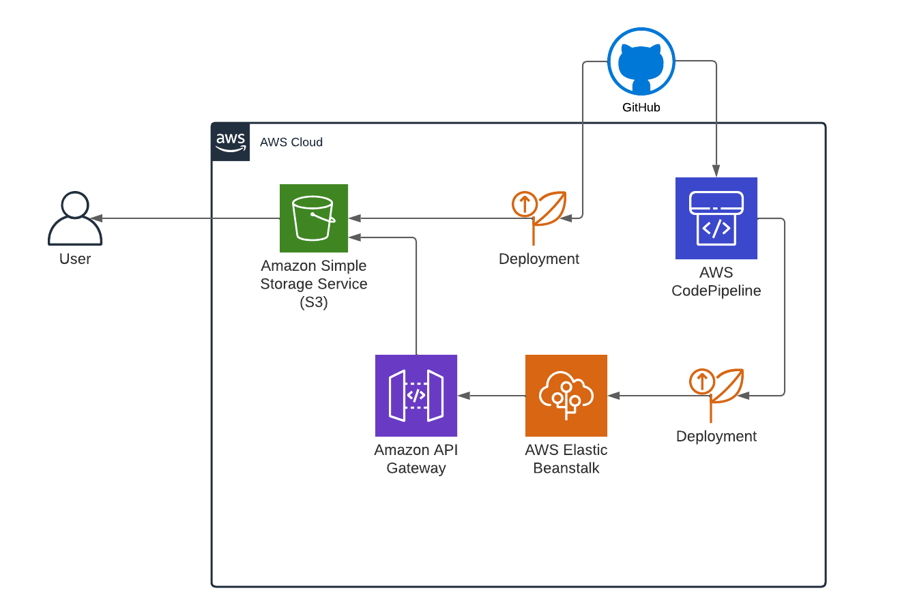

# Tasks Optimization - Optimization System Work

Simple website for optimize your tasks or works!

***[Access Task Optimization website here!](http://os-pl-task-optimization.s3-website-sa-east-1.amazonaws.com)***

### Main Folders

- **README.md** - Documentation
- **Front-end** - React static website aplication
- **Back-end** - Python flask web API service

### Stack

- Front-end
    - HTML, CSS and JavaScript
    - React/Material-UI
- Back-end
    - Python
    - Flask
    - Libraries: PuLP and CPLEX
- Infrastructure - Amazon Web Services(AWS)
    - Amazon S3 - Host static website
    - Elastic Beanstalk - API rest application
    - CodePipeline - Implements code and build project
    - API Gateway - Set endpoints and access to API rest
- DevOps
    - Github

### Architecture

